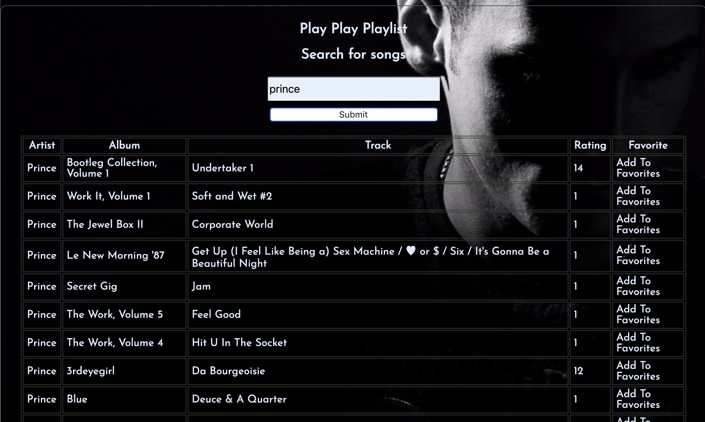
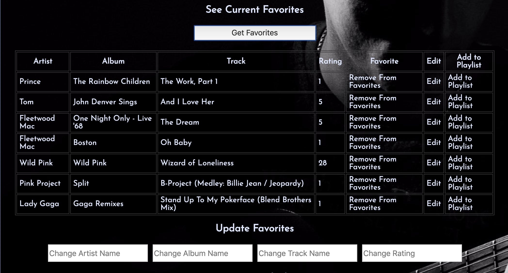

# Play Play Playlist

Play Play Playlist is a front end for the backend found [here](https://github.com/jpclark6/music-playlist-be). The site allows a user to search for an artist and see a list of their songs, add the songs to a favorites list, and then add the favorites to custom playlists. It uses the [Musicmatch API](https://developer.musixmatch.com/) to gather song data. The back end uses a PostgreSQL database to store favorited songs.

Future iterations will allow a user to sort through albums, see lyrics when available, and login/register/logout. 




## Initial Setup

To run ensure node and npm are installed and then run the following terminal commands.

```
git clone git@github.com:JSmith23/music_playlist_fe.git
cd music_playlist_fe
npm install
npm run server
```

## Tech And Tools

1. Express.js
1. Webpack
1. npm
1. jQuery
1. JavaScript
1. HTML5
1. CSS
1. Waffle.io
1. Git

## How To Use

This front end requires the back end to be running, found at [http://playlist-1810.herokuapp.com](http://playlist-1810.herokuapp.com/api/v1/favorites). It may take up to 30 seconds for the back end dyno's to start up. It currently only features one user, however more users are planned for future iterations. 

## Contributors

Made by Justin Clark [jpclark6](https://github.com/jpclark6) and Jimmy Smith [JSmith23](https://github.com/JSmith23).
